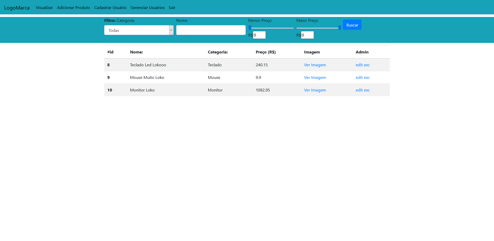
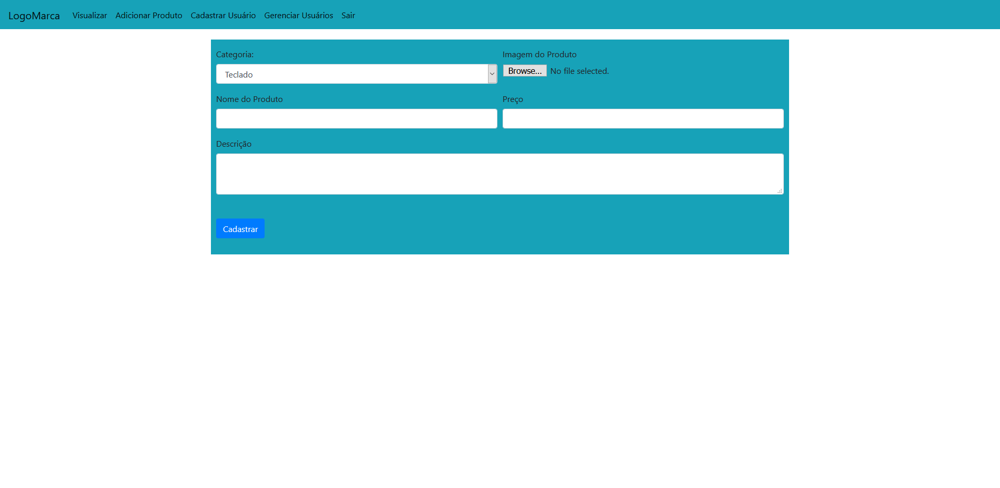
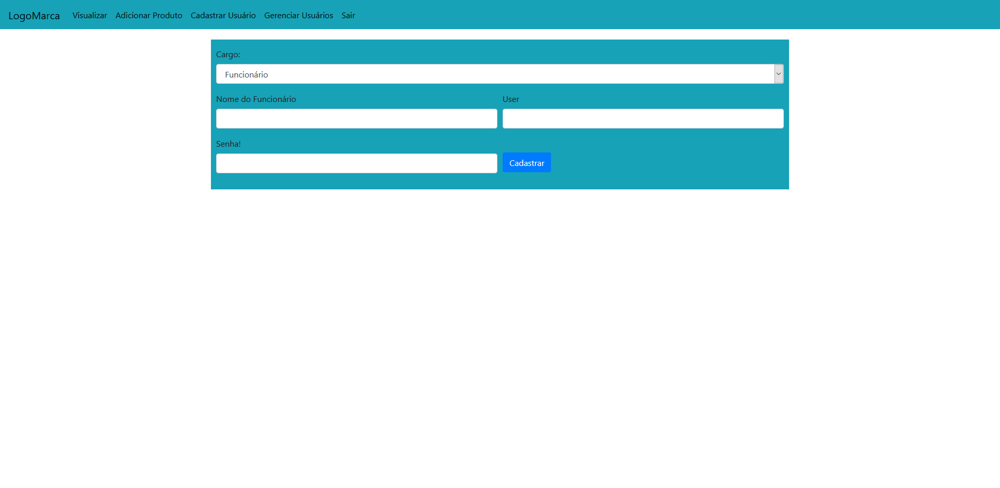
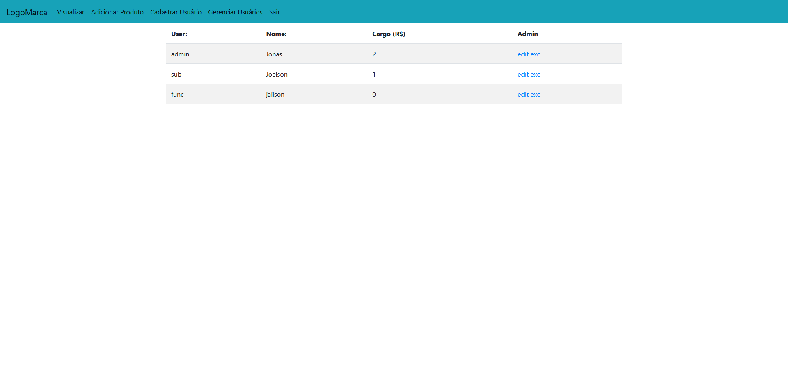

# CRUD
> Projeto de um sistema de gerenciamento de estoque de produtos eletrônicos!

Controle de Estoque com filtro de nível do Funcionário(Admin,SubAdmin,Funcionário),

> Página principal de Visualização dos Produtos.

> Página de Cadastro de Novos Produtos(Essa página pode ser acessada pelo Admin e o SubAdmin).

> Página de Cadastro de Novos Usuários(Essa página só pode ser acessada pelo Admin).

> Página de Gerenciamento de Usuários(Essa página só pode ser acessada pelo Admin).

## Instalação

### Primeiramente importe o banco de dados que esta no diretório principal.

### Depois abra o arquivo config.php e altere essas constantes a seguir:

> Coloque o link do seu diretório principal

	define('PATH_DEFAULT','diretório_principal'); 
  
> Defina as constantes para o banco de dados, se você usa um 
servidor local como xampp você só vai ter que alterar o `DATABASE` e 
colocar nome que você deu ao seu banco de dados
 
    define('HOST','localhost');
    define('USER','root');
    define('PASSWORD','');
    define('DATABASE','nome_do_database');

### Agora você pode abrir o site no seu navegador

### Para acessar use: login:`admin`, password:`admin` para Admin.
### Para acessar use: login:`sub`, password:`sub` para SubAdmin.
### Para acessar use: login:`func`, password:`func` para Funcionário Comum.

### Lembrando que cada cargo possue permissões Diferentes, para um total acesso faça login como Admin.
## Meta

Jonas Pires da Silva – jp.progdev@gmail.com
